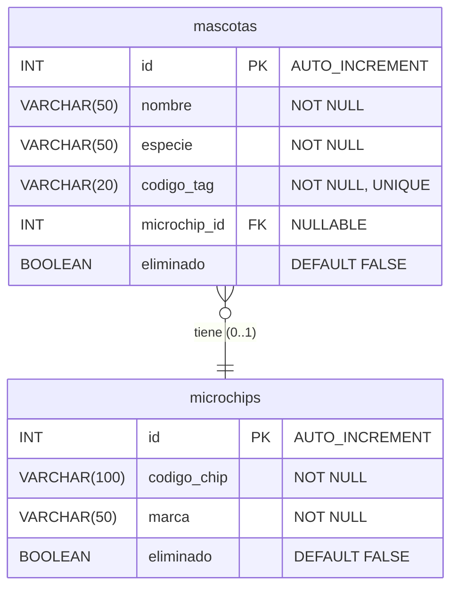

# Sistema de Gestión de Mascotas y Microchips

Un proyecto académico de **Programación 2** que implementa un sistema CRUD (Crear, Leer, Actualizar, Eliminar) en Java, siguiendo una arquitectura de 4 capas con persistencia en MySQL.
-----

### Descripción del Proyecto

Este Trabajo Práctico Integrador (TPI) tiene como objetivo aplicar los conceptos fundamentales de **Programación Orientada a Objetos** y **Persistencia de Datos**. El proyecto consiste en un sistema completo de gestión de mascotas y sus microchips de identificación, permitiendo operaciones CRUD sobre estas entidades a través de una arquitectura robusta y profesional.

Este repositorio es una refactorización del proyecto original `Persona`/`Domicilio`, manteniendo la misma lógica estructural pero aplicada a un nuevo modelo de dominio.

-----

### 🚀 Características Principales

  * **Gestión de Mascotas**: Registrar, listar, actualizar y eliminar mascotas con validación de `codigo_tag` (identificador) único.
  * **Gestión de Microchips**: Administrar microchips de forma independiente o asociados a mascotas.
  * **Búsqueda Inteligente**: Filtrar mascotas por nombre o especie con coincidencias parciales (`LIKE`).
  * **Soft Delete**: Eliminación lógica (marcado como `eliminado = true`) que preserva la integridad de los datos y el historial.
  * **Seguridad**: Protección total contra inyección SQL mediante el uso exclusivo de `PreparedStatements`.
  * **Validación Multi-capa**: Validaciones de negocio robustas tanto en la Capa de Servicio como en la Base de Datos (constraints `UNIQUE`).
  * **Eliminación Segura**: Implementación de lógica para prevenir referencias huérfanas al eliminar microchips asociados a mascotas.

-----

### 📋 Requisitos del Sistema

| Componente | Versión Requerida |
| :--- | :--- |
| **Java JDK** | 17 o superior |
| **MySQL** | 8.0 o superior |
| **Gradle** | 8.12 (Wrapper incluido) |
| **Sistema Operativo** | Windows, Linux o macOS |

-----

## 🛠️ Instalación y Configuración

Sigue estos pasos para poner en marcha el proyecto.

### 1\. Configurar Base de Datos

Ejecuta el siguiente script SQL en tu gestor de MySQL (Workbench, DBeaver, etc.) para crear la base de datos y las tablas necesarias.

```sql
-- 1. Crear la base de datos (opcional si ya usas 'dbtpi3')
CREATE DATABASE IF NOT EXISTS dbtpi3;
USE dbtpi3;

-- 2. Crear la tabla 'microchips' (análoga a 'domicilios')
CREATE TABLE microchips (
    id INT AUTO_INCREMENT PRIMARY KEY,
    codigo_chip VARCHAR(100) NOT NULL,
    marca VARCHAR(50) NOT NULL,
    eliminado BOOLEAN DEFAULT FALSE
);

-- 3. Crear la tabla 'mascotas' (análoga a 'personas')
CREATE TABLE mascotas (
    id INT AUTO_INCREMENT PRIMARY KEY,
    nombre VARCHAR(50) NOT NULL,
    especie VARCHAR(50) NOT NULL,
    codigo_tag VARCHAR(20) NOT NULL UNIQUE, /* Análogo a 'dni' */
    microchip_id INT,
    eliminado BOOLEAN DEFAULT FALSE,
    FOREIGN KEY (microchip_id) REFERENCES microchips(id)
);
```

### 2\. Configurar Conexión

Por defecto, el proyecto se conecta a `jdbc:mysql://localhost:3306/dbtpi3` con el usuario `root` y una **contraseña vacía**.

\<details\>
\<summary\>\<strong\>⚠️ ¡Importante\! Si tu 'root' tiene contraseña\</strong\>\</summary\>

  <br>
  1.  Abre el archivo: `src/main/java/Config/DatabaseConnection.java`
  2.  Busca la línea (aprox. 22):
      ```java
      private static final String PASSWORD = System.getProperty(&quot;db.password&quot;, &quot;&quot;);
      ```
  3.  Reemplaza `&quot;&quot;` por tu contraseña real:
      ```java
      // Ejemplo si tu contraseña es &quot;12345&quot;
      private static final String PASSWORD = System.getProperty(&quot;db.password&quot;, &quot;12345&quot;);
      ```
&lt;/details&gt;

### 3\. Compilar el Proyecto

Usa el wrapper de Gradle incluido para compilar el proyecto y descargar las dependencias (como el conector de MySQL).

```bash
# En Windows (CMD o PowerShell)
.\gradlew.bat build

# En Linux/macOS (o Git Bash)
./gradlew build
```

-----

## 🚀 Ejecución

### Opción 1: Desde un IDE (Recomendado)

1.  Abre el proyecto en tu IDE (IntelliJ IDEA, Eclipse, etc.).
2.  Busca la clase `Main.Main` o `Main.AppMenu`.
3.  Haz clic derecho y selecciona "Run". El IDE se encargará del classpath automáticamente.

### Opción 2: Desde la Línea de Comandos

Deberás construir manualmente el *classpath* para incluir el código compilado y el JAR del conector de MySQL.

```bash
# --- PASO 1: Encuentra el JAR de MySQL ---
# En Linux/macOS/Git Bash:
find ~/.gradle/caches -name "mysql-connector-j-8.4.0.jar"
# En Windows (CMD):
dir /s /b %USERPROFILE%\.gradle\caches\*mysql-connector-j-8.4.0.jar

# --- PASO 2: Ejecuta el programa ---
# (Reemplaza <RUTA_AL_JAR> con la ruta del paso 1)

# En Linux/macOS/Git Bash (usa ':' como separador)
java -cp "build/classes/java/main:<RUTA_AL_JAR>" Main.Main

# En Windows (CMD) (usa ';' como separador)
java -cp "build\classes\java\main;<RUTA_AL_JAR>" Main.Main
```

### Verificar Conexión

Puedes usar la clase `TestConexion` para verificar si la configuración de tu BD es correcta:

```bash
# Ejemplo en Git Bash
java -cp "build/classes/java/main:<RUTA_AL_JAR>" Main.TestConexion
```

**Salida esperada:**

```
Conexion exitosa a la base de datos
Usuario conectado: root@localhost
Base de datos: dbtpi3
URL: jdbc:mysql://localhost:3306/dbtpi3
Driver: MySQL Connector/J v8.4.0
```

-----

## 🖥️ Uso del Sistema

### Menú Principal

Al ejecutar la aplicación, verás el menú principal:

```
========= MENU MASCOTAS Y MICROCHIPS =========
1. Registrar mascota
2. Listar mascotas
3. Actualizar mascota
4. Eliminar mascota (soft delete)
5. Registrar microchip
6. Listar microchips
7. Actualizar microchip por ID
8. Eliminar microchip por ID (Peligroso)
9. Actualizar microchip por ID de mascota
10. Eliminar microchip por ID de mascota (Seguro)
0. Salir
Ingrese una opcion:
```

### Operaciones Disponibles

#### 1\. Registrar Mascota

  * Captura nombre, especie y `codigo_tag` (único).
  * Permite agregar un microchip nuevo en el mismo paso.

#### 2\. Listar Mascotas

  * Ofrece dos sub-opciones:
    1.  Listar todas las mascotas activas.
    2.  Buscar por nombre o especie (ej. "Perro" o "Vicky").

#### 3\. Actualizar Mascota

  * Pide el ID de la mascota.
  * Permite actualizar nombre, especie y `codigo_tag`.
  * Permite agregar o modificar el microchip asociado.
  * *Feature*: Presionar `Enter` en un campo mantiene el valor original.

#### 4\. Eliminar Mascota

  * Realiza un **soft delete** sobre la mascota (la marca como `eliminado = true`).
  * El microchip asociado **no se elimina** (podría ser compartido).

#### 5\. Registrar Microchip

  * Crea un registro de microchip de forma independiente (sin mascota asociada).

#### 6\. Listar Microchips

  * Muestra todos los microchips activos en la base de datos.

#### 7\. Actualizar Microchip por ID

  * Permite modificar el `codigo_chip` y la `marca` de un microchip existente.
  * Afectará a todas las mascotas que tengan este microchip asociado.

#### 8\. Eliminar Microchip por ID (Peligroso ⚠️)

  * Realiza un **soft delete** directo sobre el microchip.
  * **Advertencia**: Si una mascota está asociada a este microchip, se creará una **referencia huérfana**. Esta opción existe por completitud de CRUD.

#### 9\. Actualizar Microchip por ID de Mascota

  * Una forma alternativa de la Opción 7. Busca la mascota, obtiene su microchip y permite actualizarlo.

#### 10\. Eliminar Microchip por ID de Mascota (Seguro ✅)

  * La forma **recomendada** de eliminar un microchip.
  * Pide el ID de la mascota.
  * El sistema primero **desasocia** el microchip de la mascota (pone `microchip_id = NULL`).
  * Luego, realiza el **soft delete** sobre el microchip.
  * Esto previene referencias huérfanas y mantiene la integridad de los datos.

-----

## 🏛️ Arquitectura

Este proyecto sigue una estricta arquitectura en 4 capas para asegurar la separación de responsabilidades (SoC).

\<details\>
\<summary\>\<strong\>Ver Diagrama de Arquitectura\</strong\>\</summary\>

```
┌─────────────────────────────────────┐
│     Main / UI Layer                 │
│  (Interacción con usuario)          │
│  AppMenu, MenuHandler, MenuDisplay  │
└───────────┬─────────────────────────┘
            │ (Llama a)
┌───────────▼─────────────────────────┐
│     Service Layer                   │
│  (Lógica de negocio y validación)   │
│  MascotaServiceImpl                 │
│  MicrochipServiceImpl               │
└───────────┬─────────────────────────┘
            │ (Usa)
┌───────────▼─────────────────────────┐
│     DAO Layer                       │
│  (Acceso a datos y queries SQL)     │
│  MascotaDAO, MicrochipDAO           │
└───────────┬─────────────────────────┘
            │ (Mapea a)
┌───────────▼─────────────────────────┐
│     Models Layer                    │
│  (Entidades de dominio)             │
│  Mascota, Microchip, Base           │
└─────────────────────────────────────┘
```

\</details\>

\<details\>
\<summary\>\<strong\>Componentes Principales por Capa\</strong\>\</summary\>

  * **Config/**
      * `DatabaseConnection.java`: Gestiona la conexión JDBC (Patrón Factory).
      * `TransactionManager.java`: Maneja `commit` y `rollback` (Implementa `AutoCloseable`).
  * **Models/**
      * `Base.java`: Clase abstracta con `id` y `eliminado`.
      * `Mascota.java`: Entidad principal, análoga a `Persona`.
      * `Microchip.java`: Entidad secundaria, análoga a `Domicilio`.
  * **Dao/**
      * `GenericDAO<T>`: Interfaz genérica para operaciones CRUD.
      * `MascotaDAO`: Implementa CRUD para mascotas, usa `LEFT JOIN` para traer microchips.
      * `MicrochipDAO`: Implementa CRUD para microchips.
  * **Service/**
      * `GenericService<T>`: Interfaz genérica para la lógica de negocio.
      * `MascotaServiceImpl`: Valida mascotas (ej. `codigo_tag` único) y coordina operaciones con `MicrochipServiceImpl`.
      * `MicrochipServiceImpl`: Valida microchips (campos no vacíos).
  * **Main/**
      * `AppMenu.java`: Orquesta el menú y realiza la Inyección de Dependencias manual.
      * `MenuHandler.java`: Contiene toda la lógica de UI (captura de datos, impresión de resultados).
      * `MenuDisplay.java`: Clase utilitaria que solo imprime el texto del menú.
      * `Main.java`: Punto de entrada principal.
      * `TestConexion.java`: Utilidad para verificar la conexión a la BD.

\</details\>

-----

## 💾 Modelo de Datos



**Reglas:**

  * Una mascota puede tener **cero o un** microchip.
  * El `codigo_tag` de la mascota es **único** (constraint en BD + validación en app).
  * La eliminación es **lógica** (soft delete) usando el campo `eliminado`.
  * El `microchip_id` en `mascotas` es una Foreign Key que puede ser `NULL`.

-----

## 💡 Patrones y Buenas Prácticas

### Seguridad

  * **100% PreparedStatements**: Cero riesgo de Inyección SQL.
  * **Validación Multi-capa**: Service layer valida antes de persistir (`validateMascota`, `validateCodigoTagUnique`).

### Gestión de Recursos

  * **Try-with-resources**: Usado en todas las operaciones JDBC (DAO) para `Connection`, `PreparedStatement` y `ResultSet`.
  * **AutoCloseable**: `TransactionManager` implementa esta interfaz para asegurar `rollback` en caso de error y cierre de conexión.
  * **Cierre de Scanner**: `AppMenu.run()` cierra el `Scanner` al salir de la aplicación.

### Validaciones

  * **Input Trimming**: Todos los inputs de usuario (`scanner.nextLine()`) usan `.trim()` para limpiar espacios en blanco.
  * **Campos Obligatorios**: El Service layer valida campos `null` o vacíos.
  * **Verificación de `rowsAffected`**: Los métodos `UPDATE` y `DELETE` en los DAO verifican que al menos una fila fue afectada.

### Soft Delete

  * Ninguna operación `DELETE` ejecuta un `DELETE` de SQL.
  * Se ejecuta: `UPDATE tabla SET eliminado = TRUE WHERE id = ?`.
  * Todas las operaciones `SELECT` filtran por: `WHERE eliminado = FALSE`.

-----

## 🔧 Solución de Problemas Comunes

  * **Error: `ClassNotFoundException: com.mysql.cj.jdbc.Driver`**

      * **Causa**: El JAR de MySQL no está en el classpath.
      * **Solución**: Asegúrate de estar ejecutando con el comando `java -cp` correcto (Opción 2 de Ejecución) o usa tu IDE (Opción 1).

  * **Error: `Communications link failure` o `Connection refused`**

      * **Causa**: El servicio de MySQL no está corriendo.
      * **Solución**: Inicia el servicio de MySQL en tu máquina.

  * **Error: `Access denied for user 'root'@'localhost' (using password: YES/NO)`**

      * **Causa**: La contraseña en `Config/DatabaseConnection.java` es incorrecta.
      * **Solución**: Revisa el **Paso 2 de Instalación** y pon tu contraseña de `root` correcta. Recuerda **recompilar** (`./gradlew build`) después de cambiarla.

  * **Error: `Unknown database 'dbtpi3'`**

      * **Causa**: No has ejecutado el script SQL.
      * **Solución**: Ejecuta el script del **Paso 1 de Instalación**.

  * **Error: `Table 'mascotas' doesn't exist`**

      * **Causa**: Las tablas no fueron creadas.
      * **Solución**: Ejecuta el script del **Paso 1 de Instalación**.

-----

\<details\>
\<summary\>\<strong\>🎓 Contexto Académico y Conceptos Aplicados\</strong\>\</summary\>

  <br>
  Este proyecto fue diseñado para cumplir con los objetivos del Trabajo Práctico Integrador (TPI) de **Programación 2**, demostrando competencia en los siguientes criterios (basado en la rúbrica original):

| Concepto | Implementación en el Proyecto |
| :--- | :--- |
| **Herencia** | Clase abstracta `Base` heredada por `Mascota` y `Microchip`. |
| **Polimorfismo** | Interfaces `GenericDAO<T>` y `GenericService<T>`. |
| **Encapsulamiento** | Atributos `private` con getters/setters en todas las entidades. |
| **Abstracción** | Interfaces que definen contratos (DAO, Service) y clases abstractas (`Base`). |
| **JDBC** | Conexión, `PreparedStatements`, `ResultSets`, transacciones. |
| **DAO Pattern** | Clases `MascotaDAO` y `MicrochipDAO` que abstraen el acceso a datos. |
| **Service Layer** | Lógica de negocio separada en `MascotaServiceImpl` y `MicrochipServiceImpl`. |
| **Exception Handling** | `Try-catch` en todas las capas, propagación controlada de `SQLException`. |
| **Resource Management** | `Try-with-resources` para todos los recursos `AutoCloseable` de JDBC. |
| **Dependency Injection** | Construcción manual de dependencias en `AppMenu.createMascotaService()`. |
| **Integridad de Datos** | Validación de `codigo_tag` único y eliminación segura. |

\</details\>

-----

\<p align="center"\>
\<small\>Proyecto Educativo - TPI de Programación 2\</small\>
\</p\>
